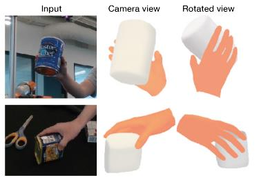

<section>

        

            
        

        

            <h1 class="post-title">
            <a href=""><b>Jonathan Freer</b></a><svg height="30" class="octicon octicon-link-external" viewBox="0 0 16 16" version="1.1" width="30" aria-hidden="true"><path fill-rule="evenodd" d="M10.604 1h4.146a.25.25 0 01.25.25v4.146a.25.25 0 01-.427.177L13.03 4.03 9.28 7.78a.75.75 0 01-1.06-1.06l3.75-3.75-1.543-1.543A.25.25 0 0110.604 1zM3.75 2A1.75 1.75 0 002 3.75v8.5c0 .966.784 1.75 1.75 1.75h8.5A1.75 1.75 0 0014 12.25v-3.5a.75.75 0 00-1.5 0v3.5a.25.25 0 01-.25.25h-8.5a.25.25 0 01-.25-.25v-8.5a.25.25 0 01.25-.25h3.5a.75.75 0 000-1.5h-3.5z"></path></svg>
            </h1>
            

            
Ph.D. Student Department of Computer Science, University of Birmingham  Office: LG40, Intelligent Robots Lab

            

            

                

                <a href=""><i class="fas fa-envelope"></i></a>
                <!-- <a href="assets/pdf/cv.pdf"><i class="ai ai-cv"></i></a> -->
                <a href="" target="_blank" title="Google Scholar"><i class="ai ai-google-scholar"></i></a>
                <a href="" target="_blank" title="GitHub"><i class="fab fa-github"></i></a>
                <a href="" target="_blank" title="Twitter"><i class="fab fa-twitter"></i></a>
                <!-- <a href="https://www.linkedin.com/in/zhenanf" target="_blank" title="LinkedIn"><i class="fab fa-linkedin"></i></a> -->
                

                

            

        

    

</section>

<!-- ### **Biography**

I'm a Ph.D. student at the Department of Computer Science, University of Birmingham, supervised by Dr. Hyung Jin Chang and [Prof. Ales Leonardis](https://www.cs.bham.ac.uk/~leonarda/). Prior to the U.K., I obtained my M.Eng. degree from [Tongji University](https://www.tongji.edu.cn/), where I was supervised by [Prof. Qirong Tang](http://robotics-tongji.org/members/qtang) and I was a member of [the Laboratory of Robotics and Multi-Body System](http://robotics-tongji.org/).

My topic is about Human-centred AI, in particular on understanding the human-object interaction within 3D environments, including but not limited to: 3D hand-object reconstruction, 6D object pose estimation, gaze estimation and visual object tracking. This is an intersection area between computer vision, machine learning, robotics and human-computer interactions. Besides, I am broadly interested in AR/VR Systems, Human Digitalization, Visual SLAM, and Swarm Robots. -->

<!-- ### **News**
- [05/2021] I will be serving as one of the Technical Committee for [Visual Object Tracking (VOT) Challenge](https://www.votchallenge.net/vot2021/index.html) at ICCV 2021 -->

<!-- ### **Publications**

<section>
    

        <ol class="bibliography">
            <li>
            

            

                
            

            

                
MetaDrive: Composing Diverse Driving Scenarios for Generalizable Reinforcement Learning

                
Quanyi Li*,Zhenghao Peng*,Lan Feng,Qihang Zhang,Zhenghai Xue,and Bolei Zhou
                

                

                <em>IEEE Transactions on Pattern Analysis and Machine Intelligence (minor revision)</em>
                (<b>TPAMI</b>), 2022
                

                

                <a href="https://arxiv.org/pdf/2109.12674" class="btn btn-sm z-depth-0 waves-effect waves-light" role="button" target="_blank">PDF</a>
                <a href="https://github.com/metadriverse/metadrive" class="btn btn-sm z-depth-0 waves-effect waves-light" role="button" target="_blank">Code</a>
                <a href="https://metadriverse.github.io/metadrive" class="btn btn-sm z-depth-0 waves-effect waves-light" role="button" target="_blank">Website</a>
                

            

            

            </li>
        </ol>
    

</section> -->